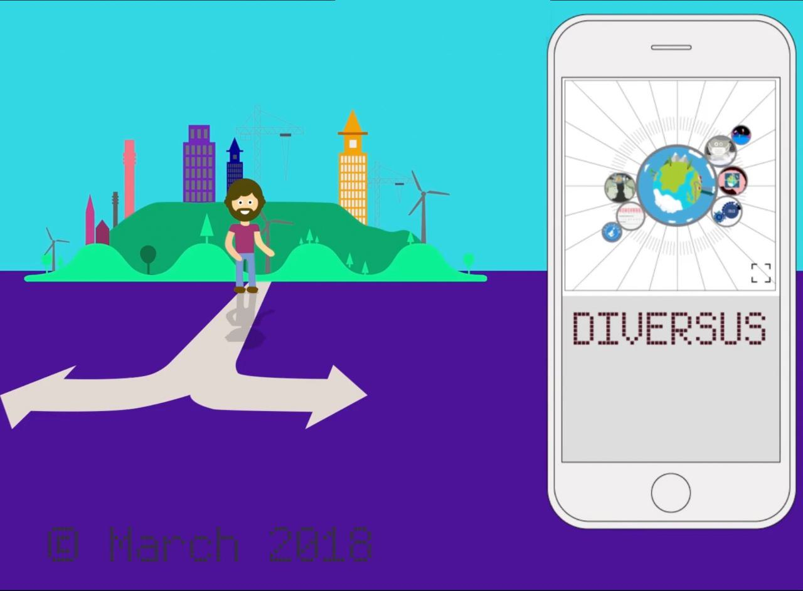

diversus-navigator
=====

# Installation

    # Install diversus-navigator from github
    git clone git@github.com:DIVERSUSandTIM/diversus-navigator.git

    # Make sure you've got a suitable version of Node
    node -v # expecting v6.11.3 or later

    # Then do classic normal npm stuff
    npm install # install needed modules

# Running the server during development

    npm run dev

# License

[GPLv3](./COPYING)
